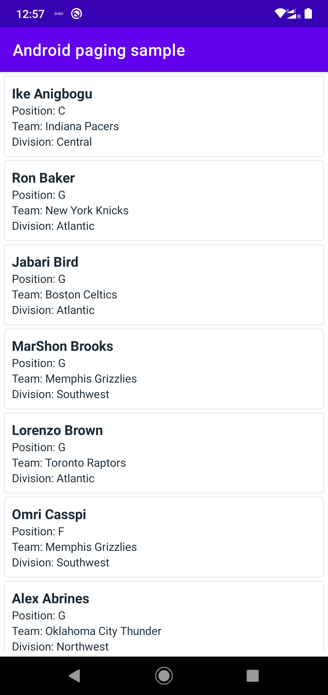

# AndroidPagingSample
This app is created as a sample app which loads players from the [balldontlie] api, and uses the [Paging3] library to show it in a ```RecyclerView```

## Screenshot
||

# Libraries used
- [Retrofit] to create network requests.
- Mvvm architecture with Dagger Hilt
- [Paging3] for implementing paging.
- Kotlin [Coroutines]
- [Flow] 

